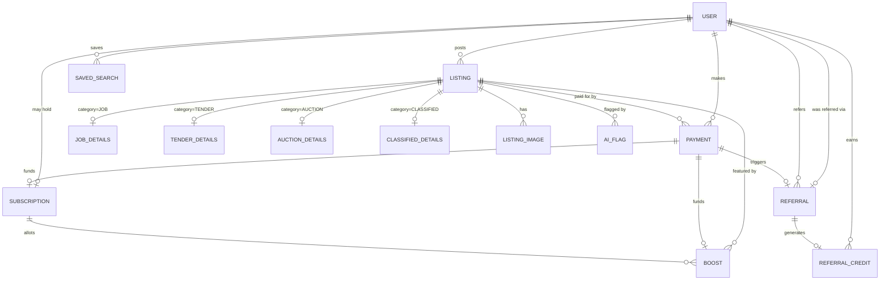

> *GetRwanda LTD | AI Automation Agency | Kigali, Rwanda*

# Amatangazo 2.0 — Data Schema

**Companion to:** `amatangazo-v2-prd.md` (v4) and `schema.prisma`
**Purpose:** Explains the entities, relationships, and design decisions behind the schema — read this before touching `schema.prisma` in Claude Code.

---

## Validation note

`npx prisma format`/`validate` couldn't run to completion in this environment — the Prisma CLI needs to download its schema-engine binary from `binaries.prisma.sh`, which isn't reachable from this sandbox's network allowlist. What I did instead:

- [ ] Manually audited every relation for correct cardinality (1:1 vs 1:many) and caught one real bug in the process — a `Referral → User` back-relation was typed as an array when the underlying `referredUserId` field is unique, so it's actually one-to-one. Fixed before delivery.
- [ ] Verified brace balance and that every enum referenced is defined (18 models, 19 enums, structurally sound)

🔴 **First thing to do in Claude Code:** run `npx prisma format --schema=schema.prisma` (with a real `DATABASE_URL` in `.env`) before your first migration. It'll catch anything a manual read-through can't — this schema hasn't been run through the actual Prisma parser yet.

---

## Entity-Relationship Overview

*Operational/audit tables (`ModerationLog`, `AiFlag`, `SavedSearch`, `NotificationLog`, `PricingConfig`, `UmucyoScrapeLog`) are omitted from the diagram to keep it readable — see the entity table below for all 18.*

---

## Entity Reference

| Entity | Purpose | PRD requirement |
|---|---|---|
| `User` | Identity, verification state, referral graph | P0-5, P0-6, P1 verification |
| `Listing` | Core record shared by all four categories | P0-1 |
| `JobDetails` / `TenderDetails` / `AuctionDetails` / `ClassifiedDetails` | Category-specific fields, 1:1 with `Listing` | P0-1 |
| `ListingImage` | Photos for auctions/classifieds | P0-1 |
| `Payment` | Every PawaPay transaction — publish, boost, or subscription | P0-2 |
| `Subscription` | Annual plan state + monthly boost allotment | Monetization & Pricing |
| `Boost` | A 24-hour featured placement window | Monetization & Pricing |
| `Referral` | Referrer↔referred relationship + credit lifecycle | P0-4 |
| `ReferralCredit` | Spendable credit ledger | P0-4 |
| `SavedSearch` / `NotificationLog` | Alert matching + send history | P1 notifications |
| `ModerationLog` | Admin action audit trail | P0-5 |
| `AiFlag` | AI-assisted scam/duplicate/spam flagging | P0-5 |
| `PricingConfig` | Admin-editable pricing, no code deploy needed | Monetization & Pricing |
| `UmucyoScrapeLog` | Scraper run history and breakage monitoring | P0-3 |

---

## Key Design Decisions

**Table-per-subtype for listings.** `Listing` holds everything common to all four categories; each category's unique fields live in their own 1:1 detail table (`JobDetails`, etc.) rather than one wide table with lots of nullable columns. This keeps queries and forms clean per category and makes it easy to add a fifth category later without touching the others.

**Denormalized `isCurrentlyBoosted` / `boostExpiresAt` on `Listing`.** The source of truth is the `Boost` table, but every listing page and search result needs to know "is this featured right now" cheaply. Keep these two fields in sync via the same transaction that creates or expires a `Boost` (a scheduled job or a check-on-read pattern both work — pick whichever fits your job-queue setup in Claude Code).

**Referral is a full lifecycle record, not just a pointer.** `User.referredByUserId` is a fast denormalized "who invited me" pointer set at signup. `Referral` is the separate process record (pending → credited → fraud-hold) created once, updated as the relationship matures — this is what the admin referral dashboard queries.

**Boost/Subscription funding is dual-sourced by design.** A `Boost` can be funded by a direct `Payment` (pay-per-boost or the RWF 8,000 subscriber-discount purchase) *or* by a `Subscription`'s monthly allotment (`fromAllotment = true`, `pricePaid = 0`). Both paths converge on the same table so "is this listing currently boosted" is always one query regardless of how the boost was paid for. `Boost.paymentId` is `@unique` (`Payment.boost` is a singular optional back-relation, not an array) — one payment funds exactly one boost, so the DB itself rejects any code path that tries to double-spend a payment across two `Boost` rows.

**No rollover, enforced in application logic, not the schema.** The PRD decision was that unused monthly boost allotment doesn't carry over. There's no `remainingBoosts` counter to keep in sync (and drift) — instead, query `Boost` where `subscriptionId = X AND fromAllotment = true AND createdAt` falls in the current calendar month, and compare the count against `Subscription.boostsIncludedPerMonth`. Fewer moving parts, nothing to desync.

**Featured-slot cap is also application logic, not a constraint.** The PRD's profitability reasoning depends on featured placement being scarce (a fixed number of slots per category, e.g., top 6–8). Postgres can't natively enforce "at most 8 rows where `isCurrentlyBoosted = true AND category = X`" as a constraint — this needs to live in the boost-purchase flow itself (reject or queue a boost purchase if the category's slots are full) or a rotation policy (oldest active boost gets bumped when a new one is purchased). Decide which before building the checkout flow — it changes the UX.

**SLA breach detection uses a composite index, not a stored flag.** `User` has an index on `(verificationStatus, verificationSubmittedAt)` so "show me everyone pending review for more than 48 hours" is a fast indexed query rather than a background job maintaining an `isOverdue` boolean. Simpler, always accurate.

---

## Manual Migration Steps (not covered by Prisma migrations alone)

- [ ] Enable the `pg_trgm` Postgres extension for trigram search (`CREATE EXTENSION IF NOT EXISTS pg_trgm;`) and add a GIN index on `Listing.title`/`description` — Prisma's schema format doesn't manage extensions directly, so this needs a raw SQL migration step
- [ ] Seed `PricingConfig` with the three confirmed rates: `PAY_PER_BOOST` = 10,000, `ANNUAL_SUBSCRIPTION` = 300,000, `SUBSCRIBER_BOOST_DISCOUNT` = 8,000
- [ ] Decide on a fixed sector/subcategory list (for `JobDetails.sector`, `TenderDetails.sector`, `ClassifiedDetails.subcategory`) — these are plain strings in the schema for flexibility, but you'll likely want a seeded reference list in the app layer so filters stay consistent rather than accumulating free-text variants

---

*— GetRwanda LTD*
